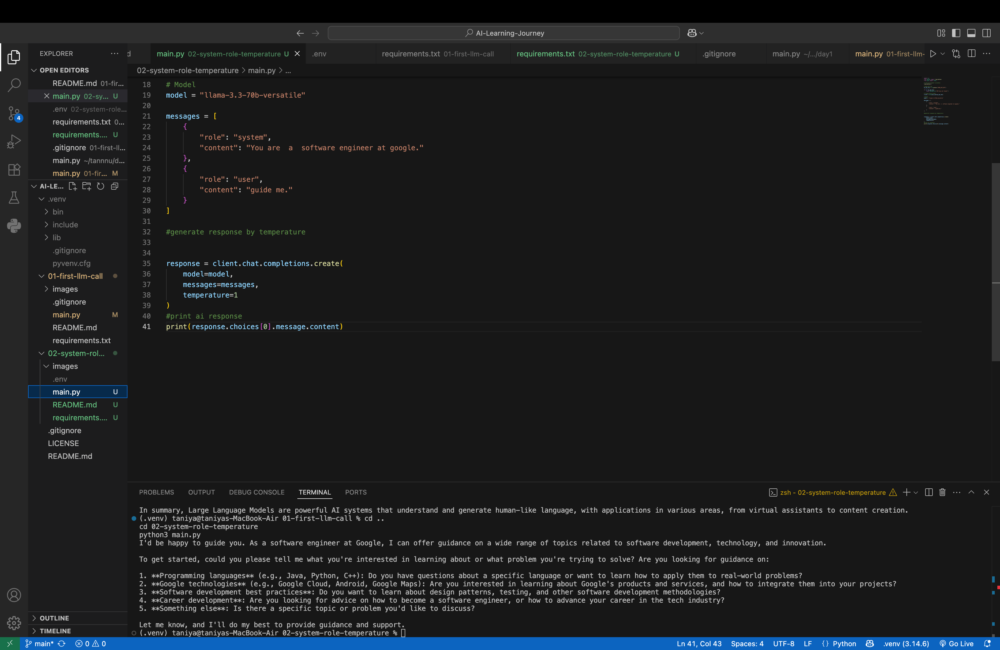

# 🎭 Day 2 – System Role and Temperature

## 📌 Objective

The objective of this project is to understand how **System Role** and **Temperature** influence the behavior and responses of a Large Language Model (LLM).

---

## 🛠️ Technologies Used

- Python
- Groq API
- python-dotenv
- VS Code

---

## 📂 Project Structure

```
# 🎭 Day 2 – System Role and Temperature

## 📌 Objective

The objective of this project is to understand how **System Role** and **Temperature** influence the behavior and responses of a Large Language Model (LLM).

---

## 🛠️ Technologies Used

- Python
- Groq API
- python-dotenv
- VS Code

---

## 📂 Project Structure

```
02-system-role-temperature/
│
├── images/
│   └── output.png
├── .env
├── .gitignore
├── main.py
├── requirements.txt
└── README.md
```

---

## 💻 Code Overview

This project demonstrates how to:

- Load the Groq API key securely using a `.env` file.
- Assign a **System Role** to guide the AI's behavior.
- Use the **Temperature** parameter to control the creativity of the response.
- Generate and display the AI's response.

---

## 🧠 Understanding System Role

A **System Role** defines the AI's behavior or personality before it responds to the user's prompt.

For example:

```python
"You are a software engineer at Google."
```

This instructs the model to answer from the perspective of an experienced Google Software Engineer.

---

## 🌡️ Understanding Temperature

The **Temperature** parameter controls how creative or predictable the AI's responses are.

| Temperature | Response Style |
|-------------|----------------|
| 0.0 | Very focused and deterministic |
| 0.3 | More accurate and consistent |
| 0.7 | Balanced creativity |
| 1.0 | More creative and natural |
| 2.0 | Highly random and unpredictable |

In this project, the temperature is set to **1**, which produces natural and creative responses while maintaining relevance.

---

## ▶️ How to Run

1. Clone the repository.

2. Create a `.env` file and add your Groq API key:

```env
GROQ_API_KEY=your_actual_api_key
```

3. Install the required packages:

```bash
pip install -r requirements.txt
```

4. Run the program:

```bash
python3 main.py
```

---

## 📸 Output

The model responds according to the assigned **System Role** and the configured **Temperature**, demonstrating how these parameters influence the AI's behavior.



---

## 📖 What I Learned

- What a System Role is and why it is important.
- How Temperature affects AI-generated responses.
- How to guide an LLM to respond from a specific perspective.
- The difference between deterministic and creative outputs.
- Practical use of prompt engineering concepts.

---

## 🎯 Key Takeaway

System Role defines **how the AI should behave**, while Temperature controls **how creative or predictable the response should be**. Together, these parameters help generate responses that are better suited for different real-world applications.

---

## 💻 Code Overview

This project demonstrates how to:

- Load the Groq API key securely using a `.env` file.
- Assign a **System Role** to guide the AI's behavior.
- Use the **Temperature** parameter to control the creativity of the response.
- Generate and display the AI's response.

---

## 🧠 Understanding System Role

A **System Role** defines the AI's behavior or personality before it responds to the user's prompt.

For example:

```python
"You are a software engineer at Google."
```

This instructs the model to answer from the perspective of an experienced Google Software Engineer.

---

## 🌡️ Understanding Temperature

The **Temperature** parameter controls how creative or predictable the AI's responses are.

| Temperature | Response Style |
|-------------|----------------|
| 0.0 | Very focused and deterministic |
| 0.3 | More accurate and consistent |
| 0.7 | Balanced creativity |
| 1.0 | More creative and natural |
| 2.0 | Highly random and unpredictable |

In this project, the temperature is set to **1**, which produces natural and creative responses while maintaining relevance.

---

## ▶️ How to Run

1. Clone the repository.

2. Create a `.env` file and add your Groq API key:

```env
GROQ_API_KEY=your_actual_api_key
```

3. Install the required packages:

```bash
pip install -r requirements.txt
```

4. Run the program:

```bash
python3 main.py
```

---

## 📸 Output

The model responds according to the assigned **System Role** and the configured **Temperature**, demonstrating how these parameters influence the AI's behavior.


---

## 📖 What I Learned

- What a System Role is and why it is important.
- How Temperature affects AI-generated responses.
- How to guide an LLM to respond from a specific perspective.
- The difference between deterministic and creative outputs.
- Practical use of prompt engineering concepts.

---

## 🎯 Key Takeaway

System Role defines **how the AI should behave**, while Temperature controls **how creative or predictable the response should be**. Together, these parameters help generate responses that are better suited for different real-world applications.
