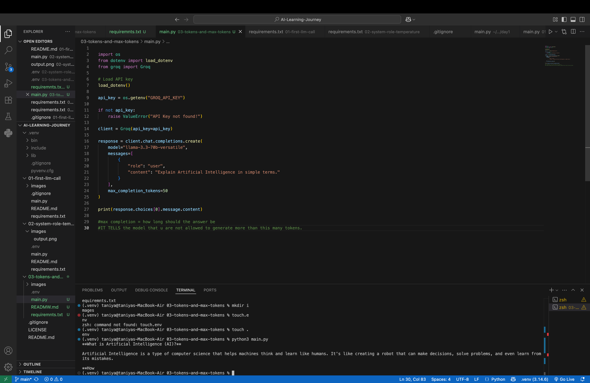
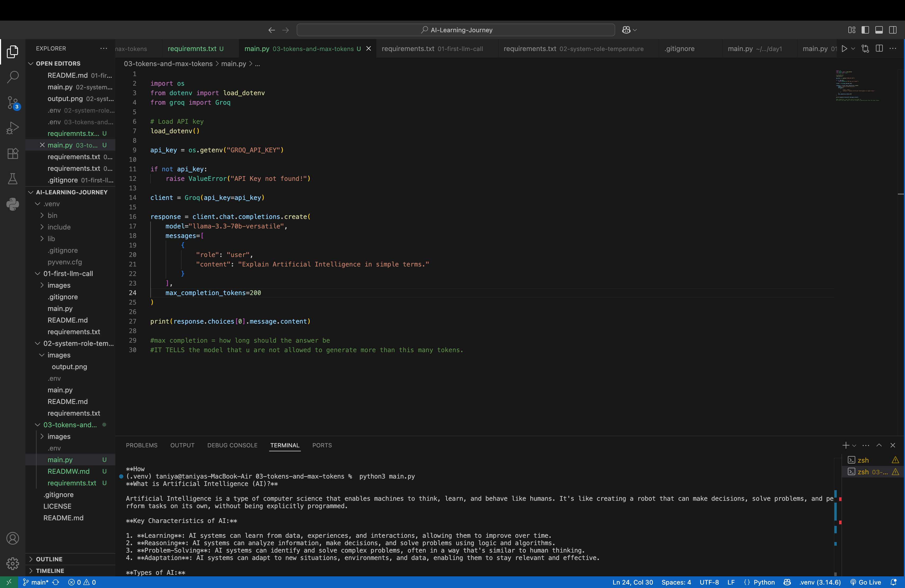

# 📘 Day 3 – Tokens and Max Completion Tokens

## 📌 Objective

The objective of this project is to understand how **max_completion_tokens** controls the length of the response generated by a Large Language Model (LLM).

---

## 🧠 What are Tokens?

A token is a small unit of text processed by an LLM. A token can be:
- A complete word
- Part of a word
- A punctuation mark
- A special character

LLMs read and generate text in the form of tokens rather than words.

---

## 🚀 What is `max_completion_tokens`?

`max_completion_tokens` defines the **maximum number of tokens** that the AI model is allowed to generate in its response.

It helps to:

- Control the response length
- Reduce API cost
- Improve response speed
- Prevent unnecessarily long outputs

---

## 🛠️ Technologies Used

- Python
- Groq API
- python-dotenv

---

## 📂 Project Structure

```
03-tokens-and-max-tokens
│
├── main.py
├── README.md
├── requirements.txt
├── .env
└── images
    ├── output-50-tokens.png
    └── output-200-tokens.png
```

---

## ▶️ How to Run

1. Clone the repository.
2. Create a `.env` file.
3. Add your Groq API key:

```
GROQ_API_KEY=your_api_key
```

4. Install dependencies:

```bash
pip install -r requirements.txt
```

5. Run the project:

```bash
python3 main.py
```

---

## 📸 Output Examples

### Example 1 – max_completion_tokens = 50



---

### Example 2 – max_completion_tokens = 200



---

## 📖 What I Learned

- What tokens are
- Difference between words and tokens
- Purpose of `max_completion_tokens`
- How response length changes with different token limits
- Why token limits affect cost, speed, and output length

---

## 🎯 Key Takeaway

A smaller value for `max_completion_tokens` generates shorter responses, while a larger value allows the model to generate more detailed answers. This parameter is useful for controlling response length and optimizing API usage.