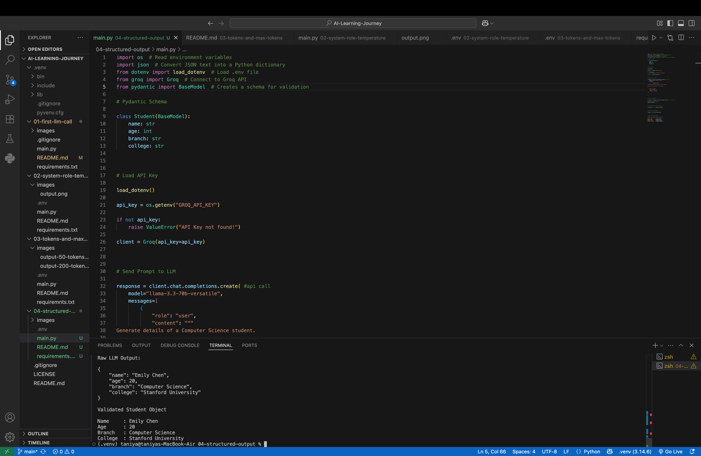

# 📦 Day 4 – Structured Output (JSON + Pydantic)

## 📌 Objective

The objective of this project is to understand how to generate **structured responses** from a Large Language Model (LLM) using **JSON** and validate them using **Pydantic**.

Instead of receiving unstructured text, the AI returns data in a predictable JSON format that can be easily processed by applications.

---

## 🛠️ Technologies Used

- Python
- Groq API
- Pydantic
- python-dotenv
- JSON

---

## 📂 Project Structure

```
04-structured-output/
│
├── images/
│   └── output.png
├── .env
├── .gitignore
├── main.py
├── requirements.txt
└── README.md
```

---

## 💻 Code Overview

This project demonstrates how to:

- Load the Groq API key securely using a `.env` file.
- Define a structured schema using **Pydantic**.
- Prompt the LLM to return **valid JSON**.
- Convert the JSON response into a Python dictionary.
- Validate the response using the Pydantic schema.
- Display the validated structured data.

---

# 🧠 What is JSON?

**JSON (JavaScript Object Notation)** is a lightweight data format used to exchange information between applications.

Example:

```json
{
    "name": "Rahul",
    "age": 21,
    "branch": "Computer Science",
    "college": "IIT Delhi"
}
```

JSON makes AI responses easier to process programmatically.

---

# 🧠 What is Pydantic?

**Pydantic** is a Python library used for **data validation**.

It allows developers to define a schema and ensures that the received data follows the expected structure and data types.

Example:

```python
class Student(BaseModel):
    name: str
    age: int
    branch: str
    college: str
```

If the AI returns incorrect data types, Pydantic raises a validation error.

---

## ▶️ How to Run

### 1. Clone the repository

```bash
git clone <repository-url>
```

### 2. Navigate to the project folder

```bash
cd 04-structured-output
```

### 3. Create a `.env` file

```env
GROQ_API_KEY=your_actual_api_key
```

### 4. Install dependencies

```bash
pip install -r requirements.txt
```

### 5. Run the project

```bash
python3 main.py
```

---

## 📸 Output

The LLM first returns a JSON response, which is then validated using the Pydantic schema before displaying the structured data.



---

## 📖 What I Learned

- What Structured Output is.
- Difference between plain text and JSON responses.
- Why AI applications prefer JSON.
- What Pydantic is and how it validates data.
- How to convert JSON into Python dictionaries.
- How to create and use schemas with Pydantic.
- How structured output improves the reliability of AI applications.

---

## 🎯 Key Takeaway

Structured Output enables Large Language Models to return predictable and machine-readable responses. By combining **JSON** with **Pydantic**, developers can validate AI-generated data, making it reliable for real-world applications such as chatbots, resume screening, email classification, document processing, and AI agents.