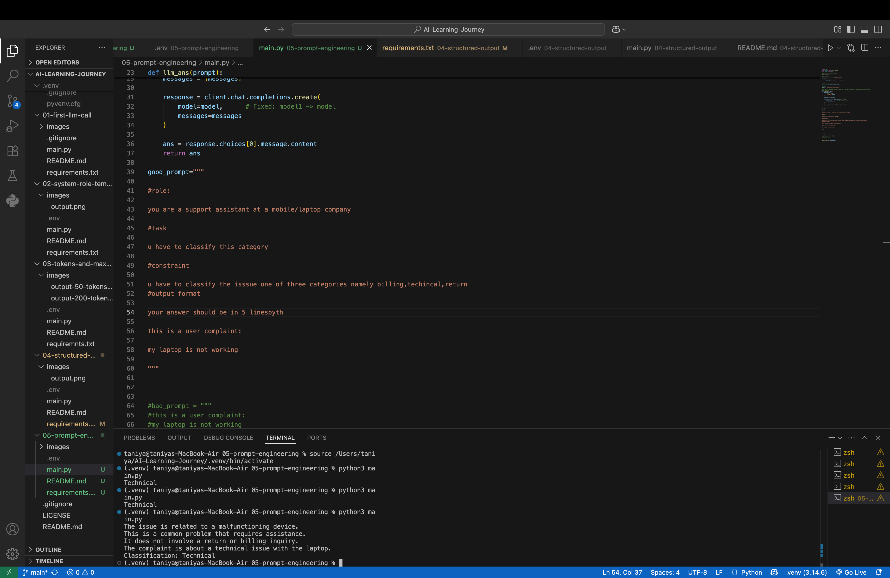

# 🧠 Day 5 – Prompt Engineering

## 📌 Objective

The objective of this project is to understand how **Prompt Engineering** improves the quality and accuracy of responses generated by a Large Language Model (LLM).

This project demonstrates how providing clear instructions, roles, constraints, and output formats helps the model generate more reliable and consistent responses.

---

## 🛠️ Technologies Used

- Python
- Groq API
- python-dotenv

---

## 📂 Project Structure

```
05-prompt-engineering/
│
├── images/
│   └── output.png
├── .env
├── .gitignore
├── main.py
├── requirements.txt
└── README.md
```

---

## 💻 Code Overview

This project demonstrates how to:

- Load the Groq API key securely using a `.env` file.
- Create a reusable function to communicate with the LLM.
- Design an effective prompt using Prompt Engineering principles.
- Classify a customer complaint into predefined categories.
- Compare the impact of a well-structured prompt with a basic prompt.

---

# 🧠 What is Prompt Engineering?

Prompt Engineering is the process of designing clear and effective prompts to guide an LLM toward producing accurate, relevant, and consistent responses.

A good prompt provides enough context for the model to understand exactly what is expected.

---

# 🧠 Components of a Good Prompt

This project uses the following Prompt Engineering structure:

### ✅ Role

Defines who the AI should act as.

Example:

```text
You are a support assistant at a mobile/laptop company.
```

---

### ✅ Task

Defines what the AI should do.

Example:

```text
Classify the customer complaint.
```

---

### ✅ Constraints

Limits the possible responses.

Example:

```text
Choose only one category:

- Billing
- Technical
- Return
```

---

### ✅ Output Format

Specifies how the response should be formatted.

Example:

```text
Return only in 5 lines
```

---

## ▶️ How to Run

### 1. Clone the repository

```bash
git clone <repository-url>
```

### 2. Navigate to the project folder

```bash
cd 05-prompt-engineering
```

### 3. Create a `.env` file

```env
GROQ_API_KEY=your_actual_api_key
```

### 4. Install dependencies

```bash
pip install -r requirements.txt
```

### 5. Run the program

```bash
python3 main.py
```

---

## 📸 Output

The LLM classifies the complaint using the instructions provided in the prompt.

Example Output:

```text
Technical
```



---

## 📖 What I Learned

- What Prompt Engineering is.
- Why prompts influence LLM responses.
- How to define a Role.
- How to define a Task.
- How to use Constraints.
- How to specify an Output Format.
- How reusable prompt templates improve AI applications.

---

## 🎯 Key Takeaway

Prompt Engineering is one of the most important skills in Generative AI. By providing clear roles, tasks, constraints, and output formats, developers can significantly improve the quality, consistency, and reliability of LLM responses in real-world AI applications.