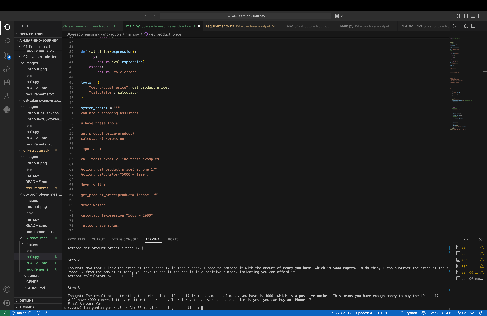

# 🤖 Day 6 – ReAct (Reasoning + Action)

## 📌 Objective

The objective of this project is to understand the **ReAct (Reasoning + Action)** framework used in AI Agents.

Instead of directly generating an answer, the LLM first reasons about the problem, decides which tool to use, executes the tool, observes the result, and then generates the final answer.

This project demonstrates how an AI agent can combine reasoning with external tool execution.

---

## 🛠️ Technologies Used

- Python
- Groq API
- Python-dotenv
- Regular Expressions (`re`)

---

## 📂 Project Structure

```
06-react-reasoning-and-action/
│
├── images/
│   └── output.png
├── .env
├── .gitignore
├── main.py
├── requirements.txt
└── README.md
```

---

# 🧠 What is ReAct?

**ReAct** stands for:

- **Reason** → Think about what needs to be done.
- **Act** → Use a tool to gather information or perform a task.

Instead of immediately answering a question, the AI follows a reasoning process.

```
Question
    │
    ▼
Thought
    │
    ▼
Action (Tool Call)
    │
    ▼
Observation
    │
    ▼
Thought
    │
    ▼
Final Answer
```

This reasoning loop is widely used in modern AI Agents.

---

## 💻 Code Overview

This project demonstrates how to:

- Connect to the Groq API.
- Build a simple AI Agent.
- Define custom tools in Python.
- Allow the LLM to decide which tool to use.
- Execute tools dynamically.
- Pass observations back to the LLM.
- Continue reasoning until the final answer is generated.

---

## 🔧 Tools Used

### 1. Product Price Tool

Returns the price of a product.

Example:

```python
get_product_price("iphone 17")
```

Output:

```text
1000
```

---

### 2. Calculator Tool

Performs mathematical calculations.

Example:

```python
calculator("5000 - 1000")
```

Output:

```text
4000
```

---

## 🔄 ReAct Workflow

The agent follows these steps:

1. Receive the user's question.
2. Think about what information is required.
3. Select the appropriate tool.
4. Execute the tool.
5. Observe the result.
6. Continue reasoning if necessary.
7. Generate the final answer.

---

## ▶️ How to Run

### 1. Clone the repository

```bash
git clone <repository-url>
```

### 2. Navigate to the folder

```bash
cd 06-react-reasoning-and-action
```

### 3. Create a `.env` file

```env
GROQ_API_KEY=your_api_key
```

### 4. Install dependencies

```bash
pip install -r requirements.txt
```

### 5. Run the project

```bash
python3 main.py
```

---

## 📸 Output

The AI agent reasons step by step before answering.

Example:

```text
Step 1

Thought:
I need to know the price.

Action:
get_product_price("iPhone 17")

Step 2

Thought:
Now I should compare the user's budget.

Action:
calculator("5000 - 1000")

Step 3

Final Answer:
Yes
```



---

## 📖 What I Learned

- What ReAct (Reason + Act) is.
- How AI Agents reason step by step.
- How LLMs can call external tools.
- How observations guide the next reasoning step.
- How to build a simple AI Agent in Python.
- How Regular Expressions (`re`) can extract tool calls from LLM responses.
- How conversation history enables multi-step reasoning.

---

## 🎯 Key Takeaway

ReAct enables Large Language Models to solve problems more intelligently by combining reasoning with external actions. Instead of guessing answers, the model can think, use tools, observe the results, and continue reasoning before producing the final response.

This Reason → Action → Observation loop is the foundation of many modern AI agents and autonomous systems.