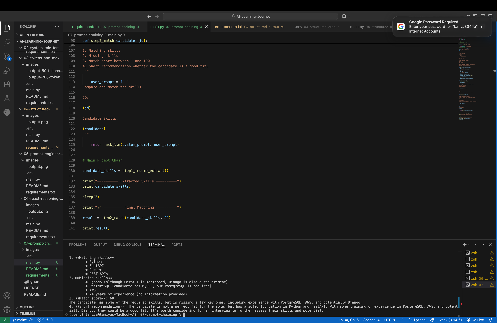

# 🔗 Day 7 – Prompt Chaining

## 📌 Objective

The objective of this project is to understand **Prompt Chaining**, a technique where multiple LLM prompts are connected together to solve a complex task step by step.

Instead of asking the model to perform everything in a single prompt, each prompt has a specific responsibility, and the output of one prompt becomes the input of the next.

This project demonstrates how Prompt Chaining can be used to automate a simple resume screening workflow.

---

## 🛠️ Technologies Used

- Python
- Groq API
- Python-dotenv

---

## 📂 Project Structure

```
07-prompt-chaining/
│
├── images/
│   └── output.png
├── .env
├── .gitignore
├── main.py
├── requirements.txt
└── README.md
```

---

# 🧠 What is Prompt Chaining?

Prompt Chaining is the process of breaking a large problem into multiple smaller prompts.

Instead of solving everything at once, the LLM solves one task at a time.

```
Input
   │
   ▼
Prompt 1
Extract Skills
   │
   ▼
Skills
   │
   ▼
Prompt 2
Compare with Job Description
   │
   ▼
Match Score + Recommendation
```

Each prompt performs only one responsibility.

---

# 💼 Project Scenario

In this project, an HR team wants to check whether a candidate is suitable for a Backend Python Developer role.

The AI performs the following tasks:

- Extract skills from the resume.
- Compare the skills with the Job Description.
- Identify matching skills.
- Identify missing skills.
- Calculate a match score.
- Provide a hiring recommendation.

---

## 🔄 Prompt Chain Workflow

```
Resume
   │
   ▼
Step 1
Extract Skills
   │
   ▼
Candidate Skills
   │
   ▼
Step 2
Compare with Job Description
   │
   ▼
Matching Skills
Missing Skills
Match Score
Recommendation
```

The output of Step 1 becomes the input of Step 2.

This is Prompt Chaining.

---

## 💻 Code Overview

This project demonstrates how to:

- Connect to the Groq API.
- Build reusable LLM functions.
- Separate complex tasks into multiple prompts.
- Pass the output of one prompt into another.
- Build a simple AI-powered resume screening workflow.

---

## ▶️ How to Run

### 1. Clone the repository

```bash
git clone <repository-url>
```

### 2. Navigate to the project

```bash
cd 07-prompt-chaining
```

### 3. Create a `.env` file

```env
GROQ_API_KEY=your_api_key
```

### 4. Install dependencies

```bash
pip install -r requirements.txt
```

### 5. Run the project

```bash
python3 main.py
```

---

## 📸 Output

Example execution:

```text
========== Extracted Skills ==========

Python
FastAPI
MySQL
Docker
REST APIs
Git

========== Final Matching ==========

Matching Skills:
- Python
- FastAPI
- Docker
- REST APIs

Missing Skills:
- PostgreSQL
- AWS

Match Score:
80/100

Recommendation:
The candidate is a good fit for the Backend Python Developer role but should improve PostgreSQL and AWS skills.
```



---

## 📖 What I Learned

- What Prompt Chaining is.
- Why multiple prompts are better than one large prompt.
- How to build reusable LLM functions.
- How to pass the output of one LLM call into another.
- How AI can automate resume screening.
- How Prompt Chaining improves modularity and maintainability.

---

## 🎯 Key Takeaway

Prompt Chaining allows Large Language Models to solve complex problems by breaking them into smaller, manageable tasks.

Instead of asking one large prompt to perform multiple jobs, each prompt focuses on a single responsibility, making AI workflows easier to build, debug, and extend.

This technique is widely used in production AI systems such as resume screening, customer support, document processing, and intelligent assistants.