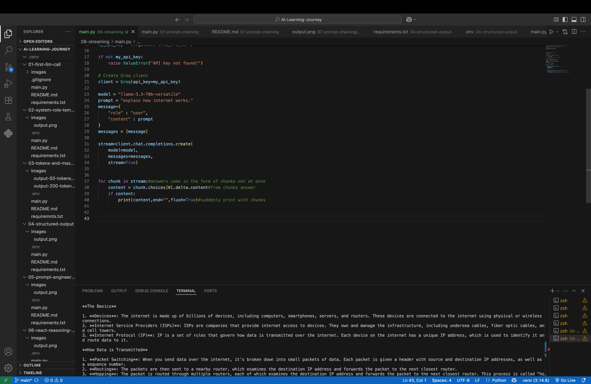

# ⚡ Day 8 – Streaming Responses

## 📌 Objective

The objective of this project is to understand **Streaming Responses** in Large Language Models (LLMs).

Normally, an LLM generates the complete response before sending it back to the user. With **streaming**, the model sends the response **token by token** (or chunk by chunk) as it is generated.

This provides a faster and more interactive user experience, just like ChatGPT.

---

## 🛠️ Technologies Used

- Python
- Groq API
- Python-dotenv

---

## 📂 Project Structure

```
08-streaming/
│
├── images/
│   └── output.png
├── .env
├── .gitignore
├── main.py
├── requirements.txt
└── README.md
```

---

# 🧠 What is Streaming?

Streaming is the process of receiving AI-generated text **incrementally**, instead of waiting for the complete response.

### Without Streaming

```
User
   │
   ▼
LLM Thinking...
   │
   ▼
Complete Response
```

The user waits until the model finishes generating the entire answer.

---

### With Streaming

```
User
   │
   ▼
LLM

The
The Internet
The Internet is
The Internet is a global...
```

The response appears gradually as it is generated.

---

# 💡 Why Streaming?

Streaming improves the user experience by:

- Reducing perceived waiting time.
- Making applications feel faster.
- Allowing users to start reading immediately.
- Providing a ChatGPT-like experience.

---

## 🔄 Workflow

```
User Prompt
      │
      ▼
Create Message
      │
      ▼
Send Request
(stream=True)
      │
      ▼
Groq API
      │
      ▼
Chunk 1
      │
      ▼
Print
      │
      ▼
Chunk 2
      │
      ▼
Print
      │
      ▼
Chunk 3
      │
      ▼
Print
      │
      ▼
Final Response
```

---

## 💻 Code Overview

This project demonstrates how to:

- Connect to the Groq API.
- Enable streaming using `stream=True`.
- Receive responses chunk by chunk.
- Extract generated text from each chunk.
- Display AI responses in real time.

---

## ▶️ How to Run

### 1. Clone the repository

```bash
git clone <repository-url>
```

### 2. Navigate to the project

```bash
cd 08-streaming
```

### 3. Create a `.env` file

```env
GROQ_API_KEY=your_api_key
```

### 4. Install dependencies

```bash
pip install -r requirements.txt
```

### 5. Run the project

```bash
python3 main.py
```

---

## 📸 Output

Example:

```text
Explain how the Internet works.

The Internet is a global network of interconnected computers...
```

Instead of waiting for the full response, the text appears **continuously** as it is generated.



---

## 📖 What I Learned

- What streaming responses are.
- Difference between normal API calls and streaming.
- How `stream=True` works.
- How to process streamed chunks.
- How to extract `delta.content`.
- How to build a ChatGPT-like typing experience.

---

## 🎯 Key Takeaway

Streaming allows Large Language Models to send responses incrementally instead of waiting for the entire output.

This technique significantly improves responsiveness and is widely used in AI chat applications such as ChatGPT, Claude, Gemini, GitHub Copilot, and Perplexity.