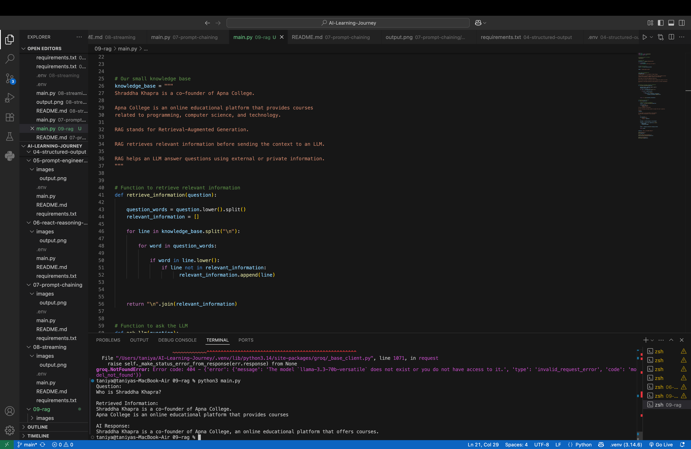

# Day 9 — Introduction to RAG (Retrieval-Augmented Generation)

## 📌 Overview

Today, I learned the basics of **RAG (Retrieval-Augmented Generation)** and implemented a simple RAG workflow using a custom knowledge base and an LLM.

Instead of sending a user's question directly to the LLM, the system first searches for relevant information from a knowledge base. The retrieved information is then provided to the LLM as context to generate a more relevant answer.

---

## 🤔 What is RAG?

**RAG stands for Retrieval-Augmented Generation.**

It is a technique that improves an LLM's response by retrieving relevant external information before generating an answer.

A normal LLM workflow looks like:

```text
Question
   ↓
LLM
   ↓
Answer
```

A RAG workflow looks like:

```text
Question
   ↓
Retrieve Relevant Information
   ↓
Add Retrieved Information as Context
   ↓
LLM
   ↓
Generate Answer
```

---

## 🔤 Understanding R, A, and G

### 🔍 R — Retrieval

The system searches the knowledge base and retrieves information relevant to the user's question.

In this project, I implemented a simple keyword-based retrieval function.

### ➕ A — Augmentation

The retrieved information is added to the prompt as additional context.

The LLM receives:

```text
Retrieved Context + User Question
```

### 🤖 G — Generation

The LLM uses the provided context to generate the final response.

---

## ⚙️ How This Project Works

```text
Knowledge Base
      ↓
User Question
      ↓
Keyword-Based Retrieval
      ↓
Relevant Information
      ↓
Context + Question
      ↓
LLM
      ↓
Final Answer
```

---

## 💻 Implementation

### 1. Create a Knowledge Base

A small custom knowledge base contains information that can be retrieved based on the user's question.

```python
knowledge_base = """
Shraddha Khapra is a co-founder of Apna College.

Apna College is an online educational platform that provides courses related to programming, computer science, and technology.

RAG stands for Retrieval-Augmented Generation.

RAG retrieves relevant information before sending the context to an LLM.

RAG helps an LLM answer questions using external or private information.
"""
```

---

### 2. Retrieve Relevant Information

The function:

```python
retrieve_information(question)
```

searches the knowledge base using keywords from the user's question.

```text
User Question
      ↓
Convert Question to Lowercase
      ↓
Split Question into Words
      ↓
Search Knowledge Base
      ↓
Find Matching Lines
      ↓
Return Relevant Information
```

---

### 3. Add Retrieved Information as Context

The retrieved information is dynamically added to the system prompt.

```python
context = retrieve_information(question)
```

The LLM receives both the context and the user's question.

```text
Context:
Retrieved Information

Question:
User Question
```

---

### 4. Generate the Final Answer

The Groq LLM generates the final response using the retrieved information as context.

---

## 🛠️ Technologies Used

* Python
* Groq API
* Large Language Models
* python-dotenv

---

## 📂 Project Structure

```text
09-rag/
│
├── images/
│   └── output.png
│
├── .env
├── .gitignore
├── main.py
├── README.md
└── requirements.txt
```

---

## 📸 Output



---

## 🧠 Key Learnings

* Learned what Retrieval-Augmented Generation (RAG) is.
* Understood the difference between a normal LLM workflow and a RAG workflow.
* Learned the meaning of Retrieval, Augmentation, and Generation.
* Implemented a simple keyword-based retrieval system.
* Retrieved relevant information from a custom knowledge base.
* Added retrieved information as context for the LLM.
* Generated an answer using the retrieved context and user question.

---

## 🚀 Important Note

This project is a **beginner-friendly implementation of the core RAG workflow**.

It uses **keyword-based retrieval** to understand the fundamental idea behind RAG.

More advanced RAG systems typically include:

```text
Documents
   ↓
Chunking
   ↓
Embeddings
   ↓
Vector Database
   ↓
Semantic Search
   ↓
Relevant Context
   ↓
LLM
   ↓
Final Answer
```

I will explore these advanced RAG components as I continue my AI Engineering learning journey.

---

## 🎯 Day 9 Completed!

Today, I built a simple implementation to understand the complete RAG workflow:

**Retrieve relevant information → Add it as context → Generate an answer using an LLM.**

**Next:** Exploring more advanced RAG concepts such as embeddings, chunking, and vector databases.
