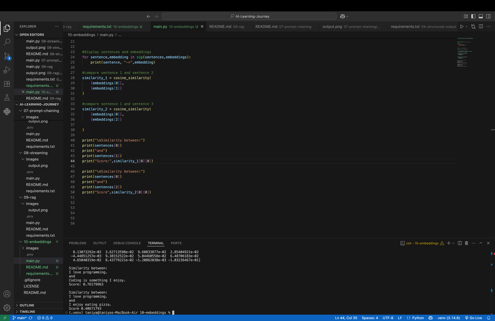

# Day 10 — Understanding Embeddings

## 📌 Overview

Today, I learned about **Embeddings**, an important concept in AI, Machine Learning, LLMs, and RAG systems.

Embeddings convert text into numerical vectors that capture semantic meaning. These vectors can then be compared to determine how similar different pieces of text are.

In this project, I:

- Converted text into embedding vectors.
- Observed the dimensional representation of embeddings.
- Compared embeddings using cosine similarity.
- Understood how semantic similarity works.
- Connected embeddings with modern RAG systems.

---

## 🤔 What are Embeddings?

Computers cannot directly understand text in the same way humans do. Therefore, embedding models convert text into numerical representations called **embedding vectors**.

For example:

```text
"I love programming."
        ↓
Embedding Model
        ↓
[-0.12, 0.45, 0.89, ...]
```

The generated list of numbers represents the meaning of the sentence in a high-dimensional vector space.

---

## 🧠 Why are Embeddings Important?

Embeddings help computers compare the **meaning of text**, instead of only checking for exact matching words.

For example:

```text
"I love programming."

"Coding is something I enjoy."
```

These sentences do not contain exactly the same words, but their meanings are related.

A keyword-based system may struggle to understand this relationship.

Embeddings allow the computer to represent the semantic meaning of both sentences as vectors and compare those vectors.

```text
Text
  ↓
Embedding Model
  ↓
Vector Representation
  ↓
Compare Vectors
  ↓
Measure Semantic Similarity
```

---

## 🔄 How Embeddings Work

The basic workflow is:

```text
Input Text
    ↓
Embedding Model
    ↓
Numerical Vector
    ↓
Compare with Other Vectors
    ↓
Similarity Score
```

For example:

```text
"I love programming."
        ↓
Embedding Model
        ↓
384-Dimensional Vector
```

Another sentence:

```text
"Coding is something I enjoy."
        ↓
Embedding Model
        ↓
384-Dimensional Vector
```

The two vectors can then be compared to determine how similar their meanings are.

---

## 💻 Implementation

### 1. Load the Embedding Model

I used the `all-MiniLM-L6-v2` model from Sentence Transformers.

```python
from sentence_transformers import SentenceTransformer

model = SentenceTransformer("all-MiniLM-L6-v2")
```

This model converts text into numerical embedding vectors.

---

### 2. Create Sentences

I used three sentences to understand semantic similarity:

```python
sentences = [
    "I love programming.",
    "Coding is something I enjoy.",
    "I enjoy eating pizza."
]
```

---

### 3. Generate Embeddings

The sentences are converted into embeddings using:

```python
embeddings = model.encode(sentences)
```

Conceptually:

```text
Sentence 1
"I love programming."
        ↓
Embedding Vector
        ↓
384 Numbers


Sentence 2
"Coding is something I enjoy."
        ↓
Embedding Vector
        ↓
384 Numbers


Sentence 3
"I enjoy eating pizza."
        ↓
Embedding Vector
        ↓
384 Numbers
```

The embedding model converts each sentence into a **384-dimensional vector**.

---

## 📊 Cosine Similarity

After generating embeddings, we need a way to compare them.

For this, I used cosine similarity:

```python
from sklearn.metrics.pairwise import cosine_similarity
```

Cosine similarity compares the direction of two vectors and returns a similarity score.

```text
Embedding 1 ──┐
              ├── Cosine Similarity ──→ Similarity Score
Embedding 2 ──┘
```

Generally:

```text
Higher Score
    ↓
More Similar Meaning


Lower Score
    ↓
Less Similar Meaning
```

---

## 🔍 Comparing the Embeddings

### Comparison 1

```python
similarity_1 = cosine_similarity(
    [embeddings[0]],
    [embeddings[1]]
)
```

This compares:

```text
"I love programming."

vs

"Coding is something I enjoy."
```

### Result

```text
Similarity Score: 0.76179963
```

These sentences have related meanings, so they received a relatively higher similarity score.

---

### Comparison 2

```python
similarity_2 = cosine_similarity(
    [embeddings[0]],
    [embeddings[2]]
)
```

This compares:

```text
"I love programming."

vs

"I enjoy eating pizza."
```

### Result

```text
Similarity Score: 0.40671793
```

These sentences are less related in meaning, so they received a lower similarity score.

---

## 📈 Results Summary

```text
"I love programming."
        ↕
"Coding is something I enjoy."

Similarity Score: 0.76179963

More Semantically Similar
```

Compared with:

```text
"I love programming."
        ↕
"I enjoy eating pizza."

Similarity Score: 0.40671793

Less Semantically Similar
```

This demonstrates that embeddings can capture semantic relationships between text.

---

## 📂 Project Structure

```text
10-embeddings/
│
├── images/
│   ├── output.png
│   └── output2.png
│
├── .gitignore
├── main.py
├── README.md
└── requirements.txt
```

---

## 📸 Output

### 1. Generated Embeddings

The embedding model converts each sentence into a numerical vector.


---

### 2. Cosine Similarity Results

The generated embedding vectors are compared using cosine similarity.



---

## 🛠️ Technologies Used

- Python
- Sentence Transformers
- `all-MiniLM-L6-v2`
- Scikit-learn
- Cosine Similarity

---

## 🧠 Key Learnings

Through this project, I learned:

- What embeddings are.
- Why text is converted into numerical vectors.
- How embedding models represent semantic meaning.
- How to use `SentenceTransformer`.
- How to generate embeddings using `all-MiniLM-L6-v2`.
- That each sentence can be represented as a 384-dimensional vector.
- What semantic similarity means.
- How cosine similarity compares embedding vectors.
- Why semantically similar sentences usually receive higher similarity scores.
- How embeddings are used in modern RAG systems.

---

## 🔗 Connection with RAG

In my previous project, I implemented a basic RAG workflow using keyword-based retrieval.

A simple keyword-based retrieval system works like:

```text
Question
   ↓
Keyword Matching
   ↓
Retrieve Information
```

However, keyword matching has limitations.

For example:

```text
Question:
Who founded Apna College?
```

A document may contain:

```text
Shraddha Khapra is a co-founder of Apna College.
```

The exact words may not completely match, but the meanings are related.

Embeddings help solve this problem through semantic similarity.

An embedding-based RAG workflow looks like:

```text
Documents
   ↓
Convert Documents into Embeddings
   ↓
Store Embeddings
   ↓
User Question
   ↓
Convert Question into Embedding
   ↓
Compare Question with Document Embeddings
   ↓
Find Semantically Similar Information
   ↓
Retrieve Relevant Context
   ↓
Send Context to LLM
   ↓
Generate Final Answer
```

This is why embeddings are an important component of modern RAG systems.

---

## 🎯 Day 10 Completed!

Today, I learned how text can be converted into numerical embedding vectors and how those vectors can be compared using cosine similarity.

I also observed how semantically similar sentences can receive higher similarity scores than less related sentences.

This project helped me understand the connection between:

```text
Text
   ↓
Embeddings
   ↓
Vectors
   ↓
Cosine Similarity
   ↓
Semantic Similarity
   ↓
Semantic Search
   ↓
RAG
```

**Next:** Exploring semantic search and learning how embeddings can retrieve relevant information based on meaning rather than exact keyword matching.