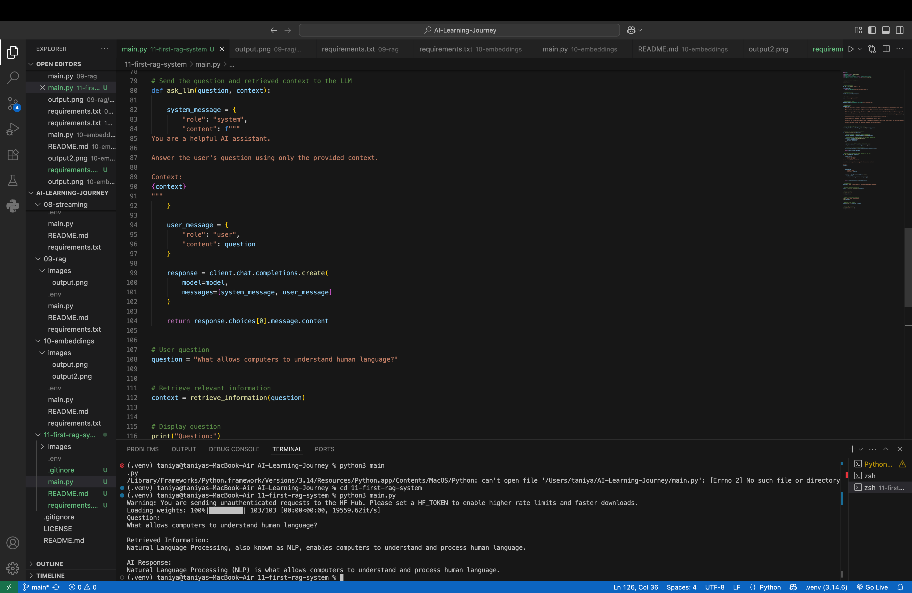

# Day 11 — Building My First RAG System

## 📌 Overview

Today, I built my first complete **Retrieval-Augmented Generation (RAG)** system.

In my previous learning days, I learned:

- **Day 9:** Introduction to RAG and basic retrieval
- **Day 10:** Embeddings and cosine similarity

In this project, I combined these concepts to build a simple **semantic RAG pipeline**.

The system takes a user's question, retrieves the most relevant information from a knowledge base using embeddings and cosine similarity, and then sends the retrieved context to an LLM to generate the final answer.

---

# 🧠 What is RAG?

RAG stands for:

```text
R → Retrieval
A → Augmentation
G → Generation
```

A RAG system improves an LLM's response by providing relevant external information as context before generating an answer.

The basic idea is:

```text
User Question
      ↓
Retrieve Relevant Information
      ↓
Add Information as Context
      ↓
LLM
      ↓
Generate Answer
```

---

# 🔄 My RAG Pipeline

The complete pipeline implemented in this project is:

```text
                 KNOWLEDGE BASE
                        ↓
             Create Document Embeddings
                        ↓
                Document Vectors
                        ↓
User Question → Create Question Embedding
                        ↓
             Compare Question and Documents
                        ↓
                Cosine Similarity
                        ↓
             Find Highest Similarity Score
                        ↓
             Retrieve Relevant Information
                        ↓
                  R = Retrieval
                        ↓
          Add Retrieved Information as Context
                        ↓
                A = Augmentation
                        ↓
               Context + User Question
                        ↓
                       LLM
                        ↓
                G = Generation
                        ↓
                  Final Answer
```

---

# 📚 Knowledge Base

For this project, I created a small AI/ML knowledge base.

```python
knowledge_base = [
    "Machine Learning is a branch of artificial intelligence that enables computers to learn patterns from data.",

    "Deep Learning is a subset of machine learning that uses neural networks with multiple layers.",

    "Natural Language Processing, also known as NLP, enables computers to understand and process human language.",

    "RAG stands for Retrieval-Augmented Generation and combines information retrieval with large language models.",

    "Embeddings convert text into numerical vectors that capture semantic meaning.",

    "Cosine similarity measures how similar two embedding vectors are.",

    "Python is one of the most commonly used programming languages in artificial intelligence and machine learning.",

    "A vector database stores and searches embedding vectors efficiently."
]
```

---

# 1️⃣ Retrieval

The first step is to convert the knowledge base into embeddings.

```python
document_embeddings = embedding_model.encode(knowledge_base)
```

Conceptually:

```text
Knowledge Base

Document 1
      ↓
Embedding 1

Document 2
      ↓
Embedding 2

Document 3
      ↓
Embedding 3
```

When a user asks a question:

```text
What allows computers to understand human language?
```

The question is also converted into an embedding.

```python
question_embedding = embedding_model.encode(question)
```

Then the question embedding is compared with all document embeddings.

```python
similarity_scores = cosine_similarity(
    [question_embedding],
    document_embeddings
)[0]
```

The system finds the highest similarity score:

```python
most_relevant_index = similarity_scores.argmax()
```

Finally, it retrieves the most relevant document.

```python
most_relevant_document = knowledge_base[most_relevant_index]
```

For the question:

```text
What allows computers to understand human language?
```

The retrieved information is:

```text
Natural Language Processing, also known as NLP,
enables computers to understand and process human language.
```

This is the **Retrieval** part of RAG.

---

# 2️⃣ Augmentation

After retrieving the relevant information, it is added to the prompt as context.

```python
system_message = {
    "role": "system",
    "content": f"""
You are a helpful AI assistant.

Answer the user's question using only the provided context.

Context:
{context}
"""
}
```

Now the LLM receives:

```text
Context:
Natural Language Processing, also known as NLP,
enables computers to understand and process human language.

Question:
What allows computers to understand human language?
```

This is called **Augmentation**.

The retrieved information augments the user's question with relevant context.

---

# 3️⃣ Generation

The context and user question are sent to the LLM.

```python
response = client.chat.completions.create(
    model=model,
    messages=[system_message, user_message]
)
```

The LLM then generates the final answer.

```text
Natural Language Processing (NLP) is what allows
computers to understand and process human language.
```

This is the **Generation** part of RAG.

---

# 💻 Technologies Used

- Python
- Groq
- Large Language Model
- Sentence Transformers
- `all-MiniLM-L6-v2`
- Scikit-learn
- Cosine Similarity
- Python Dotenv

---

# 📂 Project Structure

```text
11-first-rag-system/
│
├── images/
│   └── output.png
│
├── .env
├── .gitignore
├── main.py
├── README.md
└── requirements.txt
```

---

# 📸 Output

The system successfully performed retrieval and generation.

```text
Question:
What allows computers to understand human language?

Retrieved Information:
Natural Language Processing, also known as NLP, enables computers to understand and process human language.

AI Response:
Natural Language Processing (NLP) is what allows computers to understand and process human language.
```



---

# 🧠 Key Learnings

Through this project, I learned:

- How to build a basic RAG system
- How embeddings are used for semantic retrieval
- How to convert documents into embeddings
- How to convert user questions into embeddings
- How cosine similarity compares vectors
- How to retrieve the most relevant document
- What Retrieval means in RAG
- What Augmentation means in RAG
- What Generation means in RAG
- How to provide retrieved context to an LLM
- How embeddings connect semantic search with LLMs

---

# 🔗 Connection Between Day 9, Day 10, and Day 11

My learning progression:

```text
Day 9
Introduction to RAG
Keyword-Based Retrieval
        ↓
Day 10
Embeddings
Cosine Similarity
Semantic Similarity
        ↓
Day 11
Embedding-Based Retrieval
        +
Context Augmentation
        +
LLM Generation
        ↓
First Complete RAG System
```

---

# 🎯 What I Built

In this project, I built a basic semantic RAG system that:

```text
Knowledge Base
      ↓
Document Embeddings
      ↓
User Question
      ↓
Question Embedding
      ↓
Cosine Similarity
      ↓
Retrieve Relevant Information
      ↓
Add Context
      ↓
LLM
      ↓
Generate Final Answer
```

This project helped me understand how the core components of a RAG system work together.

---

# 🚀 Next Steps

This is a basic RAG implementation. Future improvements can include:

- Document chunking
- Top-K retrieval
- Vector databases
- Persistent vector storage
- Larger document collections
- Multiple retrieved documents
- Reranking
- RAG evaluation

---

## 🎯 Day 11 Completed

Today, I built my first complete **embedding-based RAG system**.

I combined:

```text
Embeddings
+
Cosine Similarity
+
Semantic Retrieval
+
Context Augmentation
+
LLM Generation
```

to understand how information flows through a RAG pipeline.

**Next:** Improving the RAG system with more advanced retrieval techniques.