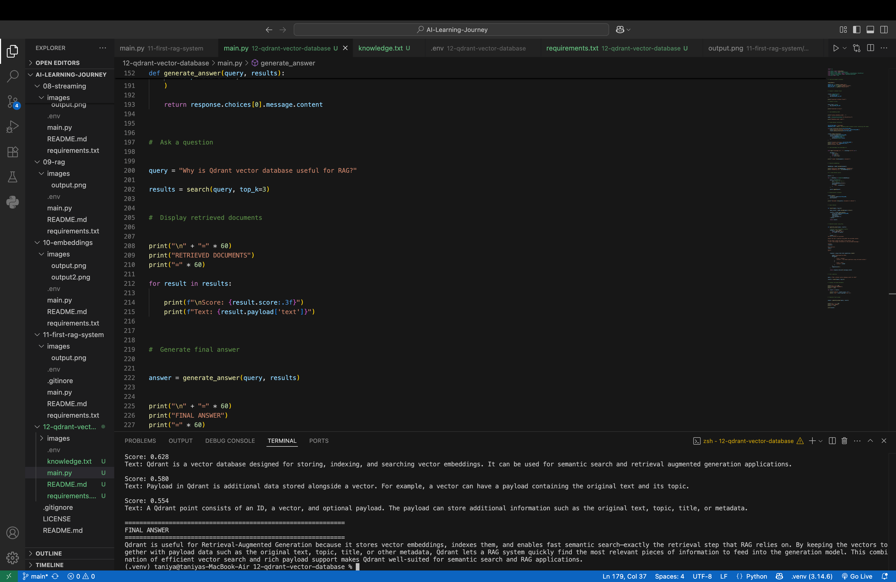

# 🚀 Day 12 — Qdrant Vector Database + RAG

Today I learned how to use **Qdrant**, a vector database, to build a practical **Retrieval-Augmented Generation (RAG)** system.

The goal of this project is to store knowledge as vector embeddings, retrieve the most relevant information using semantic search, and provide that information to an LLM to generate a context-aware answer.

---

## 📌 What I Learned

* What a vector database is
* Why vector databases are important for RAG
* What embeddings are
* How Sentence Transformers generate embeddings
* How Qdrant stores and searches vectors
* What a Qdrant collection is
* What a Qdrant point contains
* What payloads are
* How cosine similarity works
* How to perform semantic search
* How retrieved documents are passed to an LLM
* How Qdrant and Groq work together in a RAG pipeline

---

# 🧠 What is a Vector Database?

A **vector database** is a database designed to store and search **vector embeddings**.

Unlike traditional keyword-based search, vector databases allow us to search based on the **semantic meaning** of information.

For example:

```text
User Query:
"Why is Qdrant useful for RAG?"

Knowledge:
"Qdrant is a vector database designed for storing,
indexing, and searching vector embeddings."
```

Even though the exact words may be different, the meanings are related.

Qdrant identifies this relationship using vector similarity.

---

# 🔢 What are Embeddings?

An **embedding** is a numerical representation of text.

The basic process is:

```text
Text
 ↓
Sentence Transformer
 ↓
Vector Embedding
```

In this project, I used:

```text
all-MiniLM-L6-v2
```

This model converts text into a **384-dimensional vector**.

For example:

```text
"Qdrant is a vector database"
              ↓
       Sentence Transformer
              ↓
 [0.12, -0.45, 0.78, ...]
              ↓
       384 dimensions
```

These vectors allow the system to compare the semantic meaning of different pieces of text.

---

# 🗄️ Why Qdrant?

Qdrant is useful because it provides efficient **vector similarity search**.

In this project, Qdrant is responsible for:

1. Storing embeddings
2. Indexing vectors
3. Searching for similar vectors
4. Returning the most relevant documents
5. Storing metadata using payloads

---

# 🏗️ Project Architecture

```text
                knowledge.txt
                     │
                     ▼
          Sentence Transformer
                     │
                     ▼
              Text Embeddings
                     │
                     ▼
                 Qdrant
             Vector Database
                     │
                     │
              User Question
                     │
                     ▼
          Convert Query to Vector
                     │
                     ▼
              Similarity Search
                     │
                     ▼
          Relevant Documents
                     │
                     ▼
                Groq LLM
                     │
                     ▼
              Final Answer
```

---

# 🔄 RAG Pipeline

The complete RAG pipeline works in the following steps.

## 1️⃣ Load Knowledge

The system reads information from:

```text
knowledge.txt
```

Each non-empty line is treated as a document.

---

## 2️⃣ Generate Embeddings

Each document is converted into a vector using:

```python
SentenceTransformer("all-MiniLM-L6-v2")
```

The model produces a **384-dimensional embedding** for each document.

---

## 3️⃣ Store Vectors in Qdrant

Each document is stored as a Qdrant point containing:

```text
ID + Vector + Payload
```

Example:

```python
PointStruct(
    id=1,
    vector=embedding.tolist(),
    payload={
        "text": documents[i]
    }
)
```

---

## 4️⃣ Search for Relevant Information

When a user asks a question, the question is also converted into an embedding.

Qdrant then searches for the most similar vectors.

```python
results = client.query_points(
    collection_name=COLLECTION_NAME,
    query=query_vector,
    limit=top_k,
    with_payload=True,
).points
```

---

## 5️⃣ Retrieve Relevant Documents

The system retrieves the top matching documents based on vector similarity.

Example:

```text
Score: 0.628

Qdrant is a vector database designed for storing,
indexing, and searching vector embeddings.
```

The retrieved documents provide the relevant context required by the LLM.

---

## 6️⃣ Generate the Final Answer

The retrieved documents are combined into a context.

The context and user's question are then sent to the **Groq LLM**.

The LLM generates the final answer using the retrieved information.

This is the core idea behind **Retrieval-Augmented Generation**.

---

# 📂 Project Structure

```text
12-qdrant-vector-database/
│
├── main.py
├── knowledge.txt
├── README.md
├── requirements.txt
├── .env
├── .gitignore
│
└── images/
    └── output.png
```

> ⚠️ `.env` contains API credentials and should **never be uploaded to GitHub**.

---

# 🛠️ Technologies Used

| Technology            | Purpose                         |
| --------------------- | ------------------------------- |
| Python                | Programming language            |
| Qdrant                | Vector database                 |
| Sentence Transformers | Generate embeddings             |
| all-MiniLM-L6-v2      | Embedding model                 |
| Groq                  | LLM inference                   |
| python-dotenv         | Environment variable management |

---

# 📦 Installation

Create a virtual environment:

```bash
python3 -m venv .venv
```

Activate it:

### macOS / Linux

```bash
source .venv/bin/activate
```

Install the required dependencies:

```bash
pip install qdrant-client sentence-transformers groq python-dotenv
```

---

# 🔐 Environment Variables

Create a `.env` file:

```env
QDRANT_URL=your_qdrant_url
QDRANT_API_KEY=your_qdrant_api_key
GROQ_API_KEY=your_groq_api_key
```

Never commit your API keys to GitHub.

Your `.gitignore` should contain:

```text
.env
.venv/
__pycache__/
```

---

# ▶️ Run the Project

Run the application using:

```bash
python3 main.py
```

The program performs the following steps:

```text
Connect to Qdrant
        ↓
Connect to Groq
        ↓
Load embedding model
        ↓
Read knowledge.txt
        ↓
Generate embeddings
        ↓
Create Qdrant collection
        ↓
Upload vectors
        ↓
Perform similarity search
        ↓
Retrieve relevant documents
        ↓
Send context to LLM
        ↓
Generate final answer
```

---

# 📸 Output

The following screenshot shows the successful execution of the RAG pipeline, including document retrieval and the generated final answer.



---

# 🔍 Example

### User Question

```text
Why is Qdrant vector database useful for RAG?
```

### Retrieved Documents

```text
Qdrant is a vector database designed for storing,
indexing, and searching vector embeddings.

Payload in Qdrant is additional data stored
alongside a vector.

A Qdrant point consists of an ID, a vector,
and optional payload.
```

### Final Answer

The retrieved information is provided to the Groq LLM as context, and the LLM generates an answer based on that retrieved knowledge.

---

# 🧩 Important Qdrant Concepts

## Collection

A **collection** is similar to a table in a traditional database.

It stores vectors that share the same configuration.

In this project:

```python
COLLECTION_NAME = "knowledge"
```

---

## Point

A Qdrant point contains:

```text
ID + Vector + Payload
```

Example:

```text
ID
1

Vector
[0.12, -0.34, 0.56, ...]

Payload
{
    "text": "Qdrant is a vector database..."
}
```

---

## Payload

A **payload** is additional information stored alongside a vector.

In this project:

```python
payload={
    "text": documents[i]
}
```

The payload allows the system to retrieve the original text after performing vector search.

---

# 📐 Cosine Similarity

This project uses:

```python
distance=Distance.COSINE
```

Cosine similarity measures how similar two vectors are based on their direction.

Conceptually:

```text
Query Vector
      │
      ├── Similar Vector → High Similarity
      │
      ├── Related Vector → Medium Similarity
      │
      └── Unrelated Vector → Low Similarity
```

Qdrant uses this similarity measure to find documents that are semantically related to the user's query.

---

# 🤖 Why RAG?

A normal LLM can answer questions using the knowledge it has already learned.

However, an LLM may not know information contained in a **private or custom knowledge base**.

RAG solves this problem by combining:

```text
Knowledge Base
      +
Vector Database
      +
LLM
```

The system first retrieves relevant information and then provides that information to the LLM as context.

Therefore:

```text
RAG = Retrieval + Generation
```

---

# 💻 What I Built

I built a complete RAG pipeline using:

```text
Python
   ↓
Sentence Transformers
   ↓
Qdrant
   ↓
Semantic Search
   ↓
Retrieved Context
   ↓
Groq LLM
   ↓
Final Answer
```

The system successfully:

* Loaded **16 documents**
* Generated **16 embeddings**
* Created a Qdrant collection
* Stored vectors in Qdrant
* Performed semantic similarity search
* Retrieved the top relevant documents
* Passed retrieved context to an LLM
* Generated a final answer

---

# 🎯 Day 12 Takeaway

The biggest concept I learned today is that **RAG does not require the LLM to know everything itself**.

Instead, we can give the LLM access to external knowledge.

The vector database acts as the **retrieval layer**:

```text
User
 ↓
Question
 ↓
Embedding
 ↓
Qdrant Search
 ↓
Relevant Knowledge
 ↓
LLM
 ↓
Answer
```

This architecture can be used to build:

* AI chatbots
* Document Q&A systems
* Knowledge assistants
* Customer support bots
* Resume assistants
* Internal company knowledge systems
* AI agents

---

# 🚀 Next Steps

In the next stages of my AI learning journey, I plan to explore:

* Better document chunking
* Metadata filtering
* Advanced RAG pipelines
* RAG evaluation
* LangChain
* LangGraph
* AI agents
* Tool calling
* Production-ready AI applications

---

# 📚 Learning Journey

This project is part of my **AI Learning Journey**, where I am learning AI/ML concepts by building practical projects step by step.

### Day 12: Qdrant Vector Database + RAG 🚀

**Learning → Building → Testing → Documenting → Improving**
