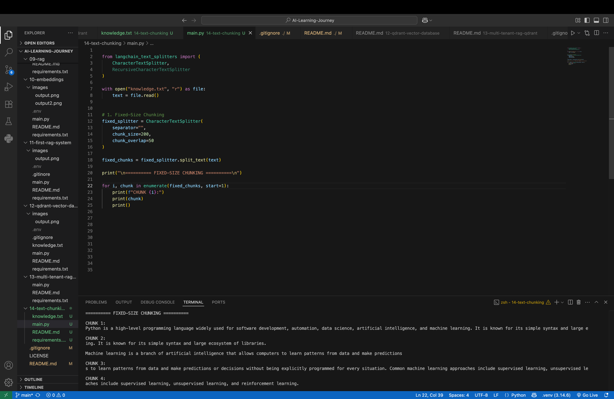
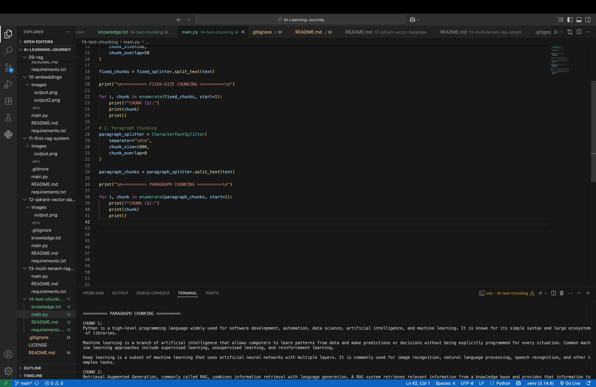
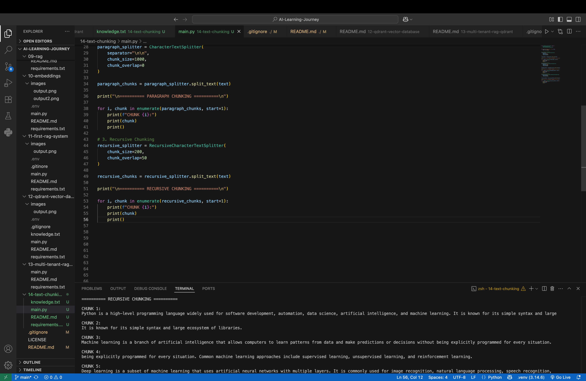

# 📚 Day 14 — Text Chunking with LangChain

> **Learning AI by Building Real Projects**

Today I learned about **Text Chunking**, an important preprocessing step in **Retrieval-Augmented Generation (RAG)** systems.

When documents are large, sending the entire document to an LLM is not always practical. Text chunking divides a large document into smaller pieces so that relevant information can be processed and retrieved more effectively.

In this project, I explored three different chunking approaches using **LangChain**:

- Fixed-Size Chunking
- Paragraph Chunking
- Recursive Chunking

---

## 🎯 What I Learned

The main goal of today's learning was to understand:

- What text chunking is
- Why chunking is important in RAG
- How LangChain text splitters work
- How different chunking strategies produce different chunks
- The role of `chunk_size`
- The role of `chunk_overlap`
- How recursive chunking differs from simple character-based splitting

---

# 🔹 1. Fixed-Size Chunking

For fixed-size chunking, I used:

```python
CharacterTextSplitter(
    separator="",
    chunk_size=200,
    chunk_overlap=50
)
How it works:

Document
    ↓
200 characters
    ↓
Chunk 1
    ↓
200 characters
    ↓
Chunk 2
    ↓
200 characters
    ↓
Chunk 3

I also used an overlap of 50 characters.

This means that some content from the previous chunk is repeated in the next chunk.

Chunk 1
        ↓
...information from the document...

             ↓ 50 character overlap

Chunk 2
        ↓
...overlapping information + new information...




🔹 2. Paragraph Chunking
 CharacterTextSplitter(
    separator="\n\n",
    chunk_size=1000,
    chunk_overlap=0
)
separator="\n\n"
is used to identify paragraph boundaries in the document

How it works
Document
    ↓
Paragraph 1
    ↓
Chunk

Paragraph 2
    ↓
Chunk

Paragraph 3
    ↓
Chunk




🔹 3. Recursive Chunking
RecursiveCharacterTextSplitter(
    chunk_size=200,
    chunk_overlap=50
)

Recursive chunking uses a hierarchy of separators to divide the text while trying to keep larger text structures together when possible.




🛠️ Technologies Used
Python
LangChain
langchain-text-splitters


📂 Project Structure

14-text-chunking/
│
├── images/
│   ├── fixed_size.png
│   ├── paragraph.png
│   └── recursive.png
│
├── knowledge.txt
├── main.py
├── README.md
└── requirements.txt


